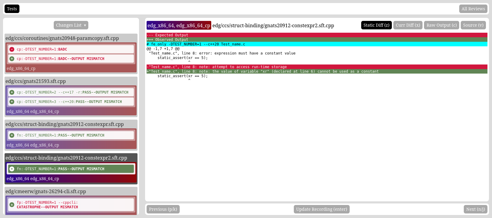

# AcknowlEDG

AcknowlEDG is a web service that allows for easy review of EDG Run Test output
and benchmark deltas when paired with the `edgy-review`, `edg-bench-review`,
and `edg-acknowledg-cli` tools (even when working with results on one or more
remote hosts).



The service is composed of a VueJS web client (which when built reduces down to
static HTML, CSS, and JavaScript files) and a Python WebSocket Server back end.
The WebSocket protocol is documented in [PROTOCOL.md](PROTOCOL.md).

Test and benchmark review sessions can share the same review UUID. Multiple
sections of each kind are supported; each CLI `--section-name` becomes a tab
under `/review/<UUID>/tests/<slug>` or `/review/<UUID>/benchmarks/<slug>`
(slug derived by lowercasing the display name, rewriting `c++` to `cpp`,
and replacing non-alphanumeric runs with dashes). The review list still only reports type presence
(Test / Benchmark / both), not every section name. List titles default to
`"Review opened by {user}"` and can be overridden with a fully custom
`--name`. Each review entry includes a client-supplied start time (captured
when the CLI starts, so reconnects keep the original time) shown in the
viewer's local timezone.

Write-capable `/source`, `/edit`, and `/batch` routes can be protected with a
shared API key via the `EDG_ACKNOWLEDG_API_KEY` environment variable.
`edg-acknowledg-cli` multiplexes many sections over `/batch` from a JSON
specification; `edgy-review` and `edg-bench-review` remain available as
task-focused CLIs that use the direct `/source` and `/edit` endpoints.

## Internal Deployment

The standard deployment of the software is as an internal service within an
organization. With API-key protection enabled on `/source` and `/edit`, the
server can also be hosted more publicly while still restricting who can publish
new review data.

The deployment descriptions below describe the basics of the setup and do not
enable HTTPS; modification of these configuration files for environments where
HTTPS is desired or required does not require special steps beyond adding the
HTTPS portions of the respective virtual host configuration.

### Client

Standard deployment of the client using a web server like Apache looks
something like the following (with `<HOSTNAME>` replaced by the desired
UI hostname):

```
<VirtualHost *:80>
        ServerName <HOSTNAME>
        DirectoryIndex index.html
        DocumentRoot /srv/http/<HOSTNAME>/

        <Location />
                RewriteEngine On
                # set the base URL prefix
                RewriteBase /
                # for requests for index.html, just respond with the file
                RewriteRule ^index.html$ - [L]
                # if requested path is not a valid filename, continue rewrite
                RewriteCond %{REQUEST_FILENAME} !-f
                # if requested path is not a valid directory, continue rewrite
                RewriteCond %{REQUEST_FILENAME} !-d
                # if you have continue to here, respond with index.html
                RewriteRule . /index.html [L]
        </Location>
</VirtualHost>

# Used to expose the web client files:
<Directory /srv/http/<HOSTNAME>/>
        # Enable the web server to act on this directory and its subdirectories.
        Require all granted
</Directory>
```

### Server

Standard deployment of the server is to run the Quart app (via Hypercorn) behind
a reverse proxy.  For Apache, this looks something like the following (with
`<HOSTNAME>` replaced by the desired API hostname):

```
<VirtualHost *:80>
        ServerName <HOSTNAME>

        ProxyPass / ws://localhost:2727/
</VirtualHost>
```

Locally, `server/run-server.sh` starts Hypercorn on `127.0.0.1:2727`.
